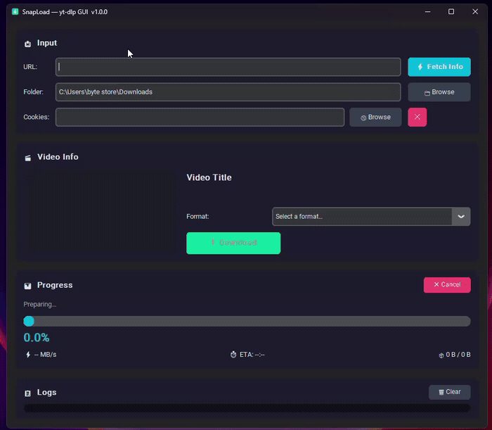

<div align="center">

# ⚡ SnapLoad — yt-dlp GUI

### A modern, professional desktop GUI for yt-dlp

[](https://python.org)
[](LICENSE)
[](https://github.com/yt-dlp/yt-dlp)

*Download videos with style. No command line required.*

</div>

---

<div align="center">

### 🎥 Live Preview



</div>

## ✨ Features

| Feature | Description |
|---|---|
| 🎬 **Metadata Fetching** | Preview video title, thumbnail, and all available formats before downloading |
| 📊 **Real-Time Progress** | Live progress bar, speed (MB/s), and ETA powered by yt-dlp's progress hooks |
| 🎛 **Format Selection** | Choose from smart presets (Best 1080p, Audio Only, etc.) or individual formats |
| 🍪 **Cookies Support** | Load a `cookies.txt` file for authenticated/age-restricted content |
| 📋 **Color-Coded Logs** | Timestamped log panel with INFO/SUCCESS/WARNING/ERROR severity levels |
| 🛡 **Smart Error Handling** | Raw yt-dlp errors are translated into user-friendly messages with suggestions |
| 🌙 **Dark Mode** | Beautiful dark theme by default — easy on the eyes |
| ⚡ **Non-Blocking UI** | Threading architecture keeps the app responsive during downloads |

---

## 📦 Installation

### Prerequisites

- **Python 3.10+** — [Download](https://www.python.org/downloads/)
- **FFmpeg** (optional but recommended) — [Download](https://ffmpeg.org/download.html)
  - Required for merging best video + best audio formats
  - Add to your system PATH after installation

### From Source

```bash
# 1. Clone the repo
git clone https://github.com/0sman1924/SnapLoad.git
cd yt-dlp-gui

# 2. Create a virtual environment (recommended)
python -m venv venv
venv\Scripts\activate        # Windows
source venv/bin/activate     # macOS/Linux

# 3. Install dependencies
pip install -r requirements.txt
```

### Standalone .exe (Windows)

Download the latest `SnapLoad.exe` from the [Releases](https://github.com/0sman1924/SnapLoad/releases) page — no Python installation required.

---

## ▶️ Running the App

After installing dependencies, you can launch SnapLoad in several ways:

| Method | Command / Action | Terminal Window? |
|---|---|---|
| **Double-click** | `SnapLoad.pyw` in the project folder | ❌ No terminal |
| **Desktop shortcut** | Run `python create_shortcut.py --desktop` once, then double-click the icon on your Desktop | ❌ No terminal |
| **CLI** | `python -m ytdlp_gui.main` | ✅ Shows terminal |

> **Tip:** To create a shortcut with the app icon on your Desktop, run:
> ```bash
> python create_shortcut.py --desktop
> ```

---

## 🚀 Usage

1. **Paste a video URL** into the URL field
2. Click **⚡ Fetch Info** to preview the video
3. **Select a format** from the dropdown (or use a smart preset)
4. Click **⬇ Download** and watch the progress in real-time
5. Check the **Logs panel** for detailed status info

### Using Cookies

Some videos require authentication (private, age-restricted, or region-locked content). To use cookies:

1. Install a browser extension like [Get cookies.txt LOCALLY](https://chromewebstore.google.com/detail/get-cookiestxt-locally/cclelndahbckbenkjhflpdbgdldlbecc)
2. Navigate to the video site and export cookies as `cookies.txt`
3. In SnapLoad, click **🍪 Browse** and select your `cookies.txt` file

---

## 🏗 Project Structure

```
yt-dlp-gui/
├── SnapLoad.pyw             # 🚀 Double-click to launch (no terminal)
├── create_shortcut.py       # Creates a Desktop shortcut with app icon
├── src/ytdlp_gui/           # Application source code
│   ├── core/                # Business logic (yt-dlp interaction)
│   │   ├── downloader.py    # Download engine + progress hooks
│   │   ├── metadata.py      # Video info fetching
│   │   └── exceptions.py    # Error parser → friendly messages
│   ├── ui/                  # CustomTkinter views
│   │   ├── main_window.py   # Root layout orchestrator
│   │   ├── input_panel.py   # URL, folder, cookies inputs
│   │   ├── info_panel.py    # Thumbnail, title, format selector
│   │   ├── progress_panel.py # Progress bar, speed, ETA
│   │   └── log_panel.py     # Color-coded scrollable logs
│   ├── utils/               # Shared helpers
│   ├── assets/              # Icon and theme files
│   ├── app.py               # Window creation & theme
│   └── main.py              # Entry point
├── tests/                   # Unit tests
├── requirements.txt
├── pyproject.toml
└── build.spec               # PyInstaller config for .exe bundling
```

---

## 🔨 Building a Standalone Executable

### Option A: Using the spec file (recommended)

```bash
pip install pyinstaller
pyinstaller build.spec
```

The executable will be at: `dist/SnapLoad.exe`

### Option B: Quick one-liner

```bash
pyinstaller --onefile --windowed --name SnapLoad src/ytdlp_gui/main.py
```

> **Note:** The built `.exe` is ~20-25 MB. For first-time users on Windows, you may need to click *"More info"* → *"Run anyway"* in SmartScreen since the executable is unsigned.

---

## 🧪 Running Tests

```bash
pip install pytest
python -m pytest tests/ -v
```

---

## 🤝 Contributing

We welcome contributions! Please see [CONTRIBUTING.md](CONTRIBUTING.md) for guidelines.

---

## 📜 License

This project is licensed under the **MIT License** — see [LICENSE](LICENSE) for details.

---

## 🙏 Acknowledgments

- [yt-dlp](https://github.com/yt-dlp/yt-dlp) — The powerful download engine powering this app
- [CustomTkinter](https://github.com/TomSchimansky/CustomTkinter) — Modern Tkinter widgets
- [Pillow](https://python-pillow.org/) — Image processing for thumbnails

---

<div align="center">

Made with ❤️ by the community

</div>
